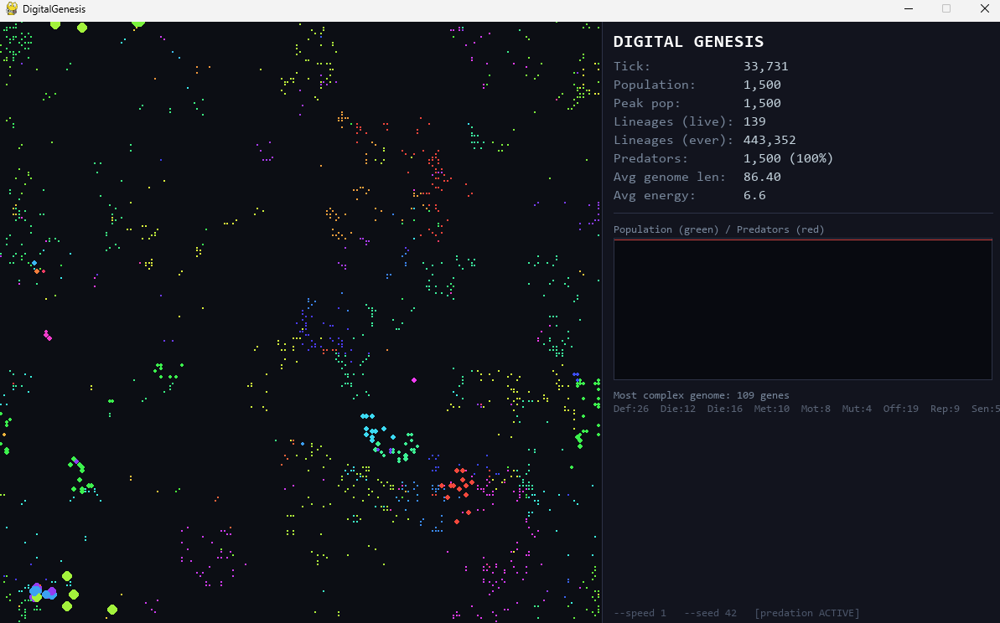

# DigitalGenesis

An open-ended evolution simulator where one cell evolved into 443,352 lineages with 109-gene creatures, none of which I coded.



---

## Success Criteria — all 4 hit

From [SPEC.md](SPEC.md):

| # | Criterion | Result |
|---|-----------|--------|
| 1 | Sim runs 1,000+ generations without total extinction | Ran to tick **33,731** |
| 2 | At least 3 distinct lineages with measurably different genomes coexist at gen 1,000 | **443,352** distinct lineages over the run |
| 3 | Predation (`DIET_CELL`) evolves spontaneously from a pure nutrient-eating start | **100% predators** at end of run |
| 4 | Average genome length increases over the run (complexity ratchet works) | Ancestor: 5 genes → avg **86.40** → peak **109 genes** |

## Final Run Stats

| Stat | Value |
|------|-------|
| Seed | 42 |
| Final tick | 33,731 |
| Final population | 1,500 |
| Predator fraction | 100% |
| Avg genome length | 86.40 |
| Most complex creature | 109 genes |
| Total lineages | 443,352 |

## How to Run

```
# Visual mode (default)
python main.py

# Fast visual — simulate 50 ticks per rendered frame
python main.py --speed 50

# Reproducible run
python main.py --seed 42

# Headless (no Pygame) — fastest, prints stats to stdout
python main.py --headless --seed 42

# Headless, stop after N ticks, print every 500
python main.py --headless --ticks 50000 --interval 500
```

## Tech Stack

- **Python 3.11+**
- **NumPy** — grid math and spatial lookups
- **Pygame** — real-time visualization
- **pytest** — unit and integration tests

## Phases Shipped

| Phase | What shipped |
|-------|-------------|
| **Phase 1** | `world.py`, `genome.py`, `cell.py`, `simulation.py` — headless sim, all 8 per-tick rules, full mutation logic |
| **Phase 2** | `tests/` — pytest suite covering all 9 spec rules (mutation validity, reproduction, eating, death, zero-cell stability) |
| **Phase 3** | `visualizer.py`, `main.py` — Pygame renderer with live stats panel, population graph, lineage colors, CLI args |
| **Tuning** | Population cap (`SOFT_POPULATION_CAP=800`), aggressive regen drop, hard crash guard |

## Project Layout

```
world.py        Grid, nutrient regen, spatial lookups
genome.py       Gene, Genome, mutation logic
cell.py         Cell class, all per-tick behavior rules
simulation.py   Main tick loop, headless runnable
visualizer.py   Pygame rendering layer
main.py         CLI entry point
tests/          pytest suite
SPEC.md         Full v1 design spec
```

## Versioning

- **v1.0** is tagged — the run above was produced from this tag.
- **v2** will rebuild the genome system using DNA-style letter strings (e.g. `SMMDRS...`) to enable crossover, sequence-level mutation, and richer analysis.
